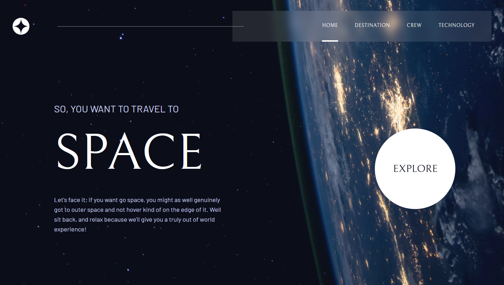

# Space Travel Website

A multi-page, responsive website that allows users to explore the wonders of space travel. Users can discover exciting destinations, learn about the crew, and delve into the technology behind space exploration.

## Live Demo
🌐[Click here to see the live demo](https://universe-travel.netlify.app)

---

## Screenshots

### Home Page


---

## Setup Instructions

1. **Clone the Repository**:
   ```bash
   git clone https://github.com/PAPAshady/space-travel.git
   ```
2. **Navigate to the Project Directory**:
   ```bash
   cd space-travel
   ```
3. **Install Dependencies**:
   ```bash
   npm install
   ```
4. **Start the Development Server**:
   ```bash
   npm run dev
   ```
5. **Open the App**:
   - The app will run at `http://localhost:5173`.

6. **Build for Production**:
   ```bash
   npm run build
   ```

---

## Pages Overview

### Home Page
- Welcoming message with a bold "EXPLORE" button leading to the Destination Page.

### Destination Page
- Interactive tabs for Moon, Mars, Europa, and Titan.
- Displays destination-specific details like distance, travel time, and descriptions.

### Crew Page
- View profiles of crew members, including their roles and images.
- Switch between members with intuitive buttons.

### Technology Page
- Explore space technologies with landscape and portrait views.
- Dynamic content updates with user interaction.

### Layout
- Consistent header with navigation links.
- Blurred background effect on supported browsers during scroll.

### Hamburger Menu
- Optimized for mobile devices.
- Enables navigation between pages with ease.

---

## Features

### Responsive Design
- Adapts seamlessly to mobile, tablet, and desktop devices.
- Unique background images for each screen size.

### Interactive Pages
- **Home Page**: A landing page with a call-to-action button redirecting to the "Destination" page.
- **Destination Page**: Choose from Moon, Mars, Europa, or Titan to view detailed information.
- **Crew Page**: Discover crew members' roles, bios, and images.
- **Technology Page**: Explore space technologies like launch vehicles, spaceports, and capsules.

### Dynamic Content
- Utilizes React's `useState` for dynamic updates.
- Data-driven content sourced from a central `data.js` file.

### Smooth Navigation
- React Router for seamless page transitions.
- Mobile-friendly hamburger menu for easy navigation on smaller screens.

---

## Technologies Used

### Front-End
- **React**: Component-based architecture.
- **React Router**: Page routing and navigation.
- **Vite**: Fast development server and build tool.

### Styling
- **Tailwind CSS**: Utility-first CSS framework.
- **Custom Fonts**: `Bellefair` and `Barlow` for unique typography.

### Data Management
- Centralized static data in `data.js` for destinations, crew, and technologies.

### Linting and Formatting
- **ESLint**: Ensures consistent and error-free code.
- **Prettier**: Automatic code formatting.

---

## Contributors

- **Nima Zamani**  
  Front-End Developer | React Enthusiast | Tailwind CSS Specialist

---

Feel free to reach out for any feedback or collaboration opportunities!
